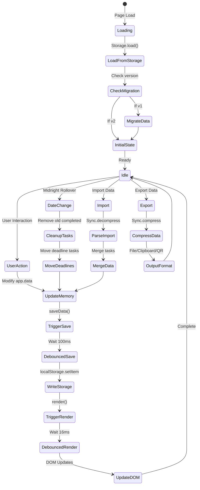
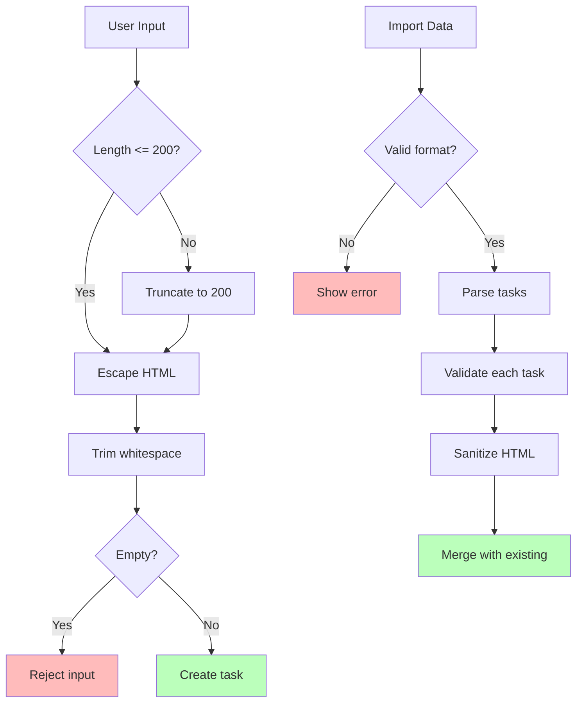

# Data Flow Diagram

## Complete Data Journey

```mermaid
graph TD
    subgraph "Input Sources"
        UserKeyboard[Keyboard Input]
        UserMouse[Mouse/Touch Input]
        FileUpload[File Upload]
        ClipboardPaste[Clipboard Paste]
        QRScan[QR Code Scan]
        URLParam[URL Parameters]
    end

    subgraph "Input Processing"
        InputField[Input Fields<br/>today-task-input<br/>tomorrow-task-input]
        EventHandlers[Event Handlers<br/>keydown, click, touch]
        ImportParsers[Import Parsers<br/>Sync.decompress]
    end

    subgraph "Data Transformation"
        CreateTask[Create Task Object<br/>{id, text, list, completed...}]
        ValidateTask[Validate & Sanitize<br/>escapeHtml, maxLength]
        EnrichTask[Enrich Data<br/>timestamp, defaults]
    end

    subgraph "State Management"
        AppData[app.data<br/>Main State Object]
        TaskArray[data.tasks Array]
        Metadata[Metadata<br/>currentDate, totalCompleted]
    end

    subgraph "Persistence Layer"
        DebounceSave[Debounced Save<br/>100ms delay]
        JSONStringify[JSON.stringify]
        LocalStorage[localStorage<br/>do-it-later-data]
    end

    subgraph "Rendering Pipeline"
        DebounceRender[Debounced Render<br/>16ms delay]
        DOMUpdate[DOM Manipulation]
        CSSAnimation[CSS Animations]
    end

    subgraph "Output Targets"
        Screen[Screen Display]
        FileDownload[File Download]
        ClipboardCopy[Clipboard Copy]
        QRDisplay[QR Code Display]
    end

    %% Input flows
    UserKeyboard --> InputField
    UserMouse --> EventHandlers
    FileUpload --> ImportParsers
    ClipboardPaste --> ImportParsers
    QRScan --> ImportParsers
    URLParam --> ImportParsers

    %% Processing flows
    InputField --> CreateTask
    EventHandlers --> CreateTask
    ImportParsers --> CreateTask

    %% Transformation flows
    CreateTask --> ValidateTask
    ValidateTask --> EnrichTask
    EnrichTask --> TaskArray

    %% State flows
    TaskArray --> AppData
    AppData --> Metadata

    %% Persistence flows
    AppData --> DebounceSave
    DebounceSave --> JSONStringify
    JSONStringify --> LocalStorage

    %% Render flows
    AppData --> DebounceRender
    DebounceRender --> DOMUpdate
    DOMUpdate --> CSSAnimation
    CSSAnimation --> Screen

    %% Export flows
    AppData --> FileDownload
    AppData --> ClipboardCopy
    AppData --> QRDisplay

    %% Load flow (reverse)
    LocalStorage -.->|Page Load| AppData

    style UserKeyboard fill:#f9f
    style UserMouse fill:#f9f
    style FileUpload fill:#f9f
    style AppData fill:#bfb
    style LocalStorage fill:#bbf
    style Screen fill:#ffb
```

## Task Object Lifecycle

```mermaid
graph LR
    subgraph "Creation"
        Input[User Input] --> New[New Task<br/>generateId()]
        New --> Initial[Initial State<br/>completed: false<br/>important: false]
    end

    subgraph "Active Life"
        Initial --> Today[In Today List]
        Initial --> Tomorrow[In Tomorrow List]
        Today <--> Tomorrow
        Today --> Completed[Mark Complete]
        Tomorrow --> Completed
        Today --> Important[Mark Important]
        Tomorrow --> Important
        Today --> Subtasks[Add Subtasks]
        Tomorrow --> Subtasks
        Today --> Deadline[Set Deadline]
        Tomorrow --> Deadline
    end

    subgraph "Completion"
        Completed --> Archive[Stays in Array<br/>completed: true]
        Archive --> Rollover[Date Rollover<br/>Cleanup]
        Rollover --> Deleted[Removed from Array]
    end

    style Input fill:#f9f
    style Completed fill:#bfb
    style Deleted fill:#fbb
```

## State Synchronization Flow



## Data Format Transformations

```mermaid
graph TD
    subgraph "Internal Format"
        InternalTask[Task Object<br/>{<br/>  id: 'abc123',<br/>  text: 'Task text',<br/>  list: 'today',<br/>  completed: false,<br/>  important: false,<br/>  subtasks: [],<br/>  deadline: null,<br/>  parentId: null<br/>}]
    end

    subgraph "Storage Format"
        StorageFormat[JSON String<br/>{<br/>  tasks: [...],<br/>  lastUpdated: 1234567890,<br/>  currentDate: '2024-01-01',<br/>  totalCompleted: 42,<br/>  version: 2<br/>}]
    end

    subgraph "Export Format"
        CompressedFormat[Compressed String<br/>T:!Task1|Task2|Task3~<br/>L:Task4|!Task5~<br/>C:42]
    end

    subgraph "QR Format"
        QRFormat[Base64 Encoded<br/>Compressed String]
    end

    InternalTask <--> StorageFormat
    StorageFormat <--> CompressedFormat
    CompressedFormat <--> QRFormat

    StorageFormat -->|JSON.stringify| LocalStorage[localStorage]
    LocalStorage -->|JSON.parse| StorageFormat

    CompressedFormat -->|File Export| TextFile[.txt file]
    CompressedFormat -->|Clipboard| ClipboardAPI[Clipboard API]
    QRFormat -->|QR Library| QRImage[QR Code Image]
```

## Critical Data Paths

### 1. User Input → Display
```
Input Field → Enter Key → addTask() → TaskManager.addTask() →
→ data.tasks.push() → saveData() → render() → DOM Update
```

### 2. Task Completion → Counter Update
```
Checkbox Click → toggleTask() → task.completed = true →
→ data.totalCompleted++ → updateCompletedCounter() → DOM Update
```

### 3. Task Movement → Animation
```
Swipe Gesture → moveTask() → task.list change →
→ CSS Animation Classes → saveData() → render()
```

### 4. Import → Merge
```
File/Clipboard/QR → Sync.decompress() → Parse tasks →
→ Merge with existing → saveData() → render()
```

### 5. Date Rollover → Cleanup
```
checkDateRollover() → Filter completed tasks →
→ Move deadline tasks → Update importance →
→ saveData() → Show notification
```

## Data Validation Points

