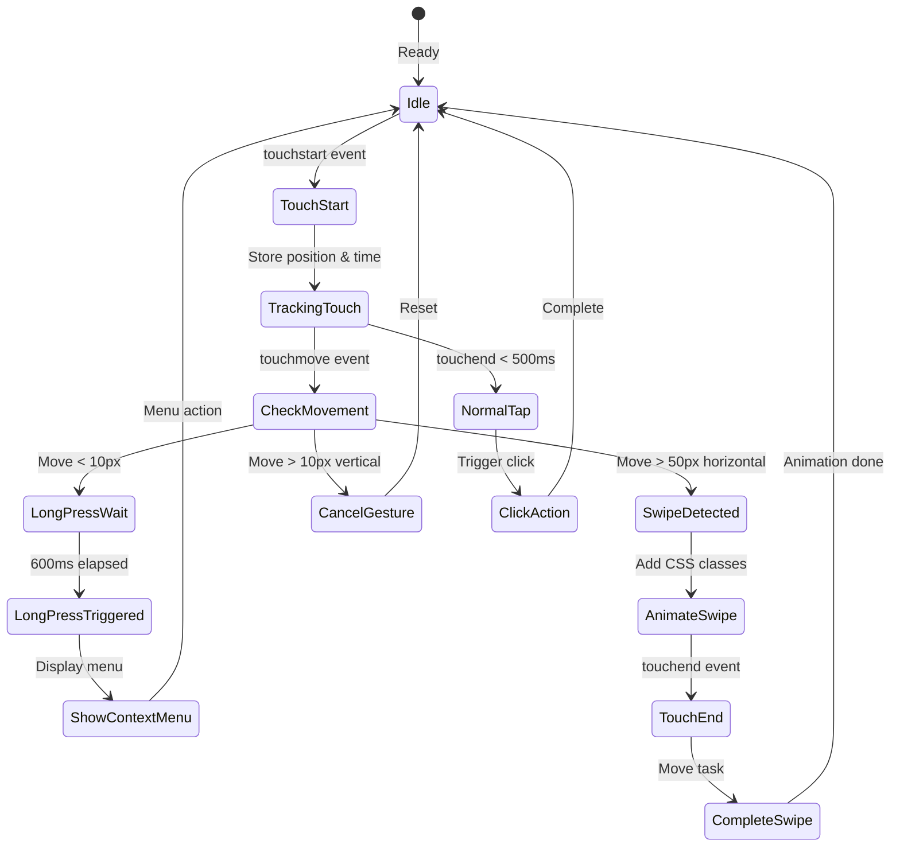
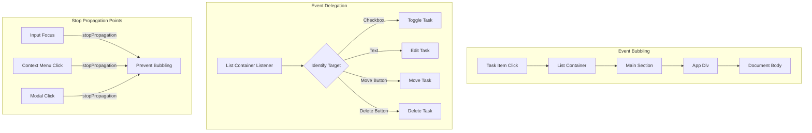
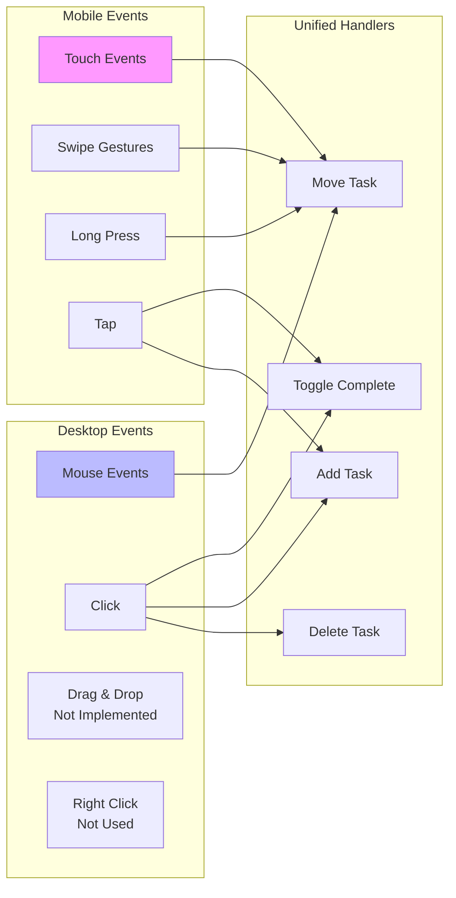
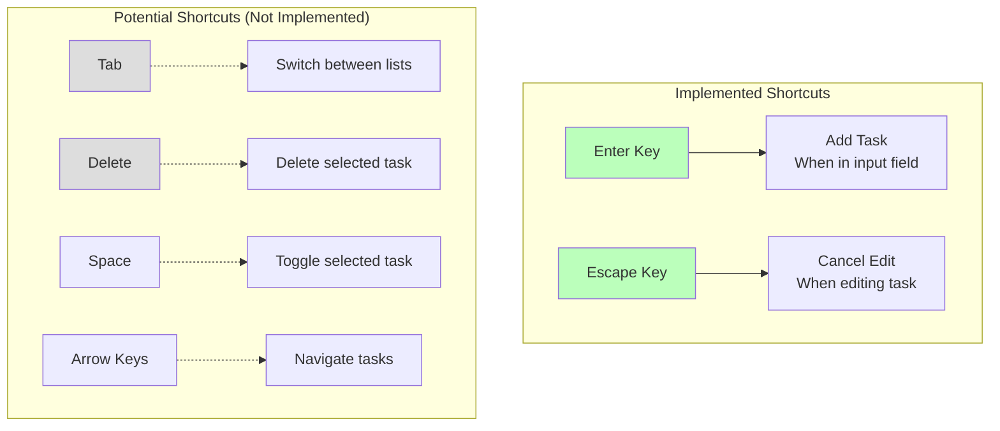
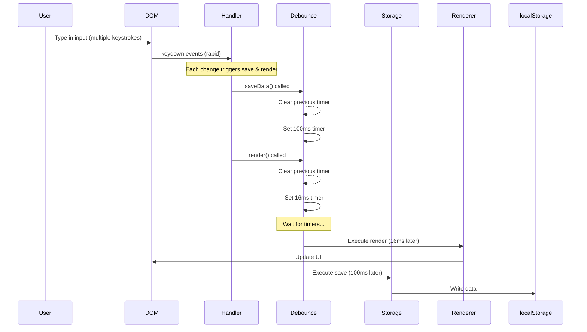
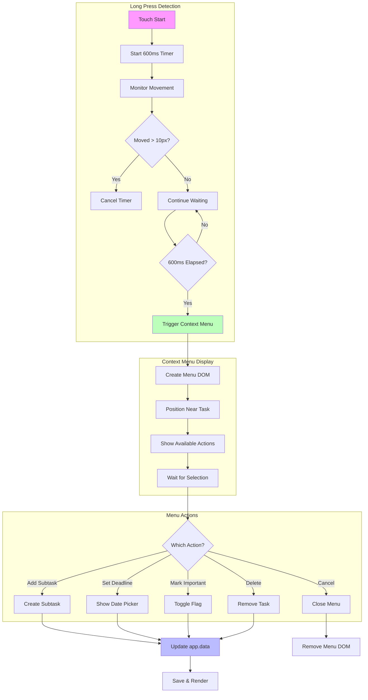

# Event Flow Diagram

## Complete Event System

```mermaid
graph TD
    subgraph "DOM Events"
        KeyEvents[Keyboard Events<br/>keydown, keyup]
        MouseEvents[Mouse Events<br/>click, mousedown, mouseup]
        TouchEvents[Touch Events<br/>touchstart, touchmove, touchend]
        ChangeEvents[Change Events<br/>input change]
        FocusEvents[Focus Events<br/>focus, blur]
    end

    subgraph "Event Listeners"
        InputListeners[Input Field Listeners<br/>Enter key → Add task]
        CheckboxListeners[Checkbox Listeners<br/>Click → Toggle task]
        ButtonListeners[Button Listeners<br/>Click → Actions]
        SwipeListeners[Swipe Gesture Listeners<br/>Touch → Move task]
        LongPressListeners[Long Press Listeners<br/>Hold → Context menu]
    end

    subgraph "Event Handlers"
        AddTaskHandler[addTask()<br/>Create new task]
        ToggleTaskHandler[toggleTask()<br/>Complete/uncomplete]
        MoveTaskHandler[moveTask()<br/>Change list]
        DeleteTaskHandler[deleteTask()<br/>Remove task]
        EditTaskHandler[editTask()<br/>Modify text]
        ContextMenuHandler[showContextMenu()<br/>Show options]
    end

    subgraph "State Updates"
        DataUpdate[Update app.data]
        SaveTrigger[Trigger saveData()]
        RenderTrigger[Trigger render()]
    end

    subgraph "UI Updates"
        DOMManipulation[DOM Updates]
        CSSClasses[CSS Class Changes]
        Animations[CSS Animations]
    end

    %% Event flow connections
    KeyEvents --> InputListeners
    MouseEvents --> CheckboxListeners
    MouseEvents --> ButtonListeners
    TouchEvents --> SwipeListeners
    TouchEvents --> LongPressListeners
    ChangeEvents --> InputListeners
    FocusEvents --> InputListeners

    InputListeners --> AddTaskHandler
    CheckboxListeners --> ToggleTaskHandler
    ButtonListeners --> MoveTaskHandler
    ButtonListeners --> DeleteTaskHandler
    SwipeListeners --> MoveTaskHandler
    LongPressListeners --> ContextMenuHandler

    AddTaskHandler --> DataUpdate
    ToggleTaskHandler --> DataUpdate
    MoveTaskHandler --> DataUpdate
    DeleteTaskHandler --> DataUpdate
    EditTaskHandler --> DataUpdate

    DataUpdate --> SaveTrigger
    DataUpdate --> RenderTrigger
    RenderTrigger --> DOMManipulation
    DOMManipulation --> CSSClasses
    CSSClasses --> Animations

    style KeyEvents fill:#f9f
    style MouseEvents fill:#f9f
    style TouchEvents fill:#f9f
    style DataUpdate fill:#bfb
```

## Touch Gesture Detection



## Event Propagation & Delegation



## Mobile vs Desktop Event Handling



## Keyboard Shortcuts



## Event Timing & Debouncing



## Context Menu Event Flow



## Custom Event System

```mermaid
graph TD
    subgraph "Custom Events (Potential Enhancement)"
        TaskAdded[task-added Event]
        TaskCompleted[task-completed Event]
        TaskMoved[task-moved Event]
        DataSaved[data-saved Event]
        ThemeChanged[theme-changed Event]
    end

    subgraph "Event Emitters"
        AddTask[addTask()] --> TaskAdded
        ToggleTask[toggleTask()] --> TaskCompleted
        MoveTask[moveTask()] --> TaskMoved
        SaveData[saveData()] --> DataSaved
        ToggleTheme[toggleTheme()] --> ThemeChanged
    end

    subgraph "Event Listeners"
        TaskAdded --> Analytics[Analytics Tracking]
        TaskCompleted --> Achievements[Achievement System]
        TaskMoved --> SyncModule[Sync Module]
        DataSaved --> BackupModule[Backup Module]
        ThemeChanged --> PreferenceModule[Preference Module]
    end

    style TaskAdded fill:#ddd
    style Analytics fill:#ddd
    Note[Note: Custom events not currently implemented]
```