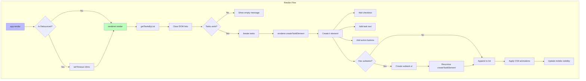
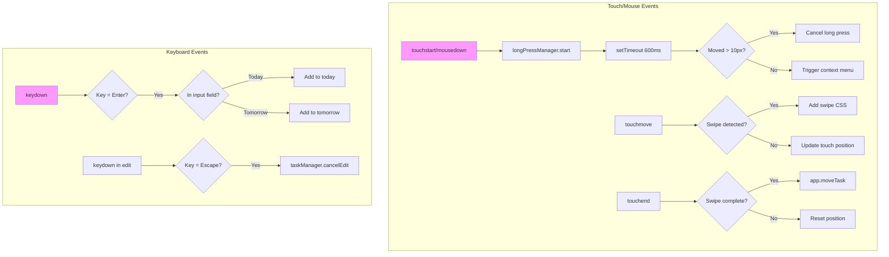

# Function Call Graph

## Main Application Flow

```mermaid
graph TD
    subgraph "Initialization"
        PageLoad[Page Load] --> AppConstructor[DoItTomorrowApp constructor]
        AppConstructor --> LoadData[Storage.load]
        AppConstructor --> InitModules[Initialize All Modules]
        InitModules --> TaskManager[new TaskManager]
        InitModules --> ImportExportManager[new ImportExportManager]
        InitModules --> Pomodoro[new PomodoroTimer]
        InitModules --> DeadlinePicker[new DeadlinePicker]
        InitModules --> DevMode[new DevMode]
        InitModules --> QRHandler[new QRHandler]
        InitModules --> Renderer[new Renderer]
        AppConstructor --> SetupLogging[setupLogging]
        AppConstructor --> InitLongPress[initializeLongPressSystem]
        AppConstructor --> Init[app.init]
    end

    subgraph "App Initialization"
        Init --> InitTheme[initTheme]
        Init --> UpdateDate[updateCurrentDate]
        Init --> CheckRollover[checkDateRollover]
        Init --> BindEvents[bindEvents]
        Init --> SetupMobile[setupMobileNavigation]
        Init --> SetupSwipe[setupSwipeGestures]
        Init --> ImportExportSetup[importExportManager.setup]
        Init --> SetupThemeToggle[setupThemeToggle]
        Init --> SetupDeleteMode[setupDeleteMode]
        Init --> SetupGlobal[setupGlobalHandlers]
        Init --> Render[render]
        Init --> UpdateCounter[updateCompletedCounter]
        Init --> RegisterSW[registerServiceWorker]
    end

    style PageLoad fill:#f9f
    style AppConstructor fill:#bbf
    style Init fill:#bfb
```

## Task Operations Call Flow

```mermaid
graph TD
    subgraph "Add Task Flow"
        UserInput[User Types in Input] --> KeyPress[Enter Key Press]
        KeyPress --> AddTask[app.addTask]
        AddTask --> TMAddTask[taskManager.addTask]
        TMAddTask --> GenerateId[taskManager.generateId]
        TMAddTask --> AddToList[taskManager.addTaskToList]
        AddToList --> PushToArray[data.tasks.push]
        AddTask --> SaveData[app.saveData]
        SaveData --> DebounceeSave[Debounced Storage.save]
        AddTask --> RenderUI[app.render]
        RenderUI --> DebounceRender[Debounced renderer.render]
    end

    subgraph "Toggle Task Flow"
        Checkbox[Checkbox Click] --> ToggleTask[app.toggleTask]
        ToggleTask --> TMToggle[taskManager.toggleTask]
        TMToggle --> FindTask[taskManager.findTaskById]
        TMToggle --> UpdateComplete[task.completed = !task.completed]
        ToggleTask --> IncrementCounter[data.totalCompleted++]
        ToggleTask --> SaveData2[app.saveData]
        ToggleTask --> RenderUI2[app.render]
        ToggleTask --> UpdateCounterUI[app.updateCompletedCounter]
    end

    subgraph "Move Task Flow"
        SwipeGesture[Swipe/Button Click] --> MoveTask[app.moveTask]
        MoveTask --> TMMoveTask[taskManager.moveTaskToList]
        TMMoveTask --> FindTask2[taskManager.findTaskById]
        TMMoveTask --> UpdateList[task.list = newList]
        MoveTask --> AnimateMove[Animate CSS classes]
        MoveTask --> SaveData3[app.saveData]
        MoveTask --> RenderUI3[app.render]
    end

    style UserInput fill:#f9f
    style Checkbox fill:#f9f
    style SwipeGesture fill:#f9f
```

## Render Pipeline

## Event Handler Chains

## Data Persistence Flow

```mermaid
graph TD
    subgraph "Save Pipeline"
        AnyChange[Any Data Change] --> SaveData[app.saveData]
        SaveData --> CheckDebounce{Debounced?}
        CheckDebounce -->|Has Timeout| ClearTimeout[Clear existing]
        ClearTimeout --> SetNewTimeout[setTimeout 100ms]
        CheckDebounce -->|No Timeout| SetNewTimeout
        SetNewTimeout --> ExecuteSave[Storage.save]

        ExecuteSave --> PrepareData[JSON.stringify data]
        PrepareData --> WriteLocalStorage[localStorage.setItem]
        WriteLocalStorage --> Success{Success?}
        Success -->|Yes| Return[Return true]
        Success -->|No| LogError[Console.error]
    end

    subgraph "Load Pipeline"
        PageLoad[Page Load] --> LoadData[Storage.load]
        LoadData --> ReadLocalStorage[localStorage.getItem]
        ReadLocalStorage --> CheckExists{Data exists?}
        CheckExists -->|No| DefaultData[getDefaultData]
        CheckExists -->|Yes| ParseJSON[JSON.parse]
        ParseJSON --> MigrateCheck{Need migration?}
        MigrateCheck -->|Yes| MigrateData[migrateData v1→v2]
        MigrateCheck -->|No| ReturnData[Return data]
        MigrateData --> ReturnData
        DefaultData --> ReturnData
    end

    style AnyChange fill:#f9f
    style PageLoad fill:#bbf
```

## Import/Export Operations

```mermaid
graph TD
    subgraph "Export Flow"
        ExportButton[Export Button Click] --> ChooseFormat{Export Type?}
        ChooseFormat -->|File| ExportFile[exportToFile]
        ChooseFormat -->|Clipboard| ExportClipboard[exportToClipboard]
        ChooseFormat -->|QR| GenerateQR[generateQRCode]

        ExportFile --> CompressData[Sync.compress]
        ExportClipboard --> CompressData
        GenerateQR --> CompressData

        CompressData --> FormatTasks[Format with delimiters]
        FormatTasks --> OutputData{Output Method?}
        OutputData -->|File| CreateBlob[Create Blob]
        OutputData -->|Clipboard| CopyToClipboard[navigator.clipboard.write]
        OutputData -->|QR| QRCode[new QRCode]

        CreateBlob --> DownloadLink[Create download link]
        DownloadLink --> TriggerDownload[Click link]
    end

    subgraph "Import Flow"
        ImportSource{Import Source?} -->|File| FileInput[File input change]
        ImportSource -->|Clipboard| ClipboardButton[Paste button]
        ImportSource -->|QR| QRScanner[QR scanner]

        FileInput --> ReadFile[FileReader.readAsText]
        ClipboardButton --> ReadClipboard[navigator.clipboard.read]
        QRScanner --> DecodeQR[jsQR decode]

        ReadFile --> ParseData[Sync.decompress]
        ReadClipboard --> ParseData
        DecodeQR --> ParseData

        ParseData --> ValidateData[Validate format]
        ValidateData --> MergeTasks[Merge with existing]
        MergeTasks --> SaveImported[Storage.save]
        SaveImported --> RenderImported[app.render]
    end

    style ExportButton fill:#f9f
    style ImportSource fill:#bbf
```

## Key Function Relationships

### Core Functions by Module

**Config (No functions, only constants)**

**Utils:**
- `generateId()` - Called by TaskManager
- `escapeHtml()` - Called by Renderer
- `formatDate()` - Called by App, Renderer
- `debounce()` - Used to wrap saveData and render
- `deepClone()` - Called by TaskManager
- `safeJsonParse()` - Called by Storage
- `safeJsonStringify()` - Called by Storage

**Storage:**
- `load()` - Called once at app start
- `save()` - Called (debounced) after any change
- `getDefaultData()` - Called if no data exists
- `migrateData()` - Called if old format detected

**TaskManager:**
- `addTask()` - Called by app on input
- `toggleTask()` - Called by app on checkbox
- `moveTaskToList()` - Called by app on swipe/button
- `deleteTask()` - Called by app in delete mode
- `editTask()` - Called by app on task text click
- `addSubtask()` - Called by app from context menu
- `findTaskById()` - Internal helper, frequently used

**Renderer:**
- `render()` - Called (debounced) after any change
- `createTaskElement()` - Called for each task
- `createCheckbox()` - Called per task element
- `createMoveButton()` - Called per task element
- `handleImportanceGradient()` - Called during render

**App (Main Controller):**
- `init()` - Called once at startup
- `saveData()` - Debounced wrapper for Storage.save
- `render()` - Debounced wrapper for Renderer.render
- All user action handlers (add, toggle, move, delete, edit)