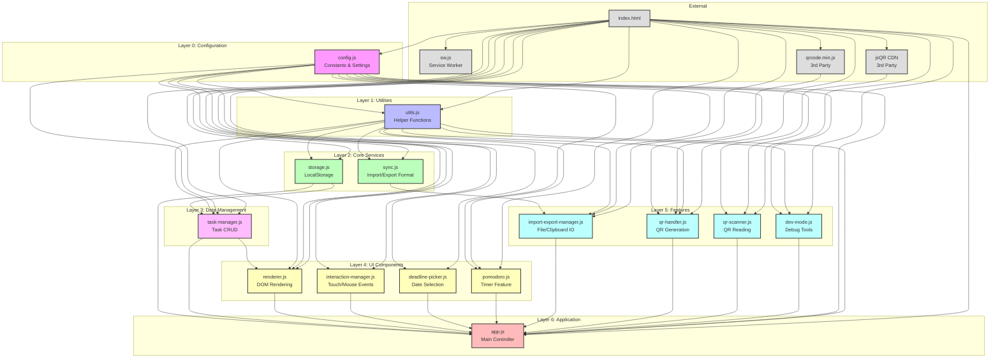
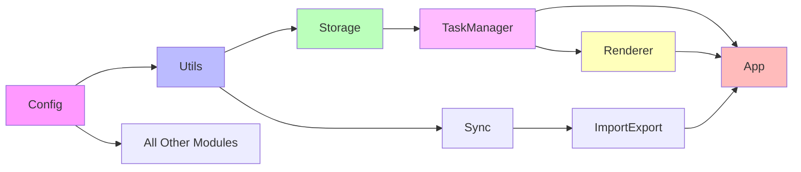
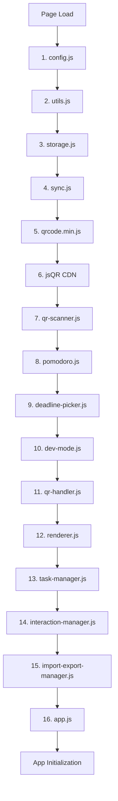

# Module Dependency Graph

## Complete Module Hierarchy

## Simplified Dependency Chain

## Module Load Order (from index.html)

## Circular Dependencies

**None detected** - The architecture maintains a clean hierarchical structure with no circular dependencies.

## Key Observations

1. **Config is the foundation** - Every module depends on Config for constants
2. **Utils is the shared library** - Provides common functions to most modules
3. **App is the orchestrator** - Instantiates and coordinates all other modules
4. **Clear layering** - Each layer depends only on layers below it
5. **No framework dependencies** - Pure vanilla JavaScript
6. **External dependencies minimal** - Only QR code libraries are external