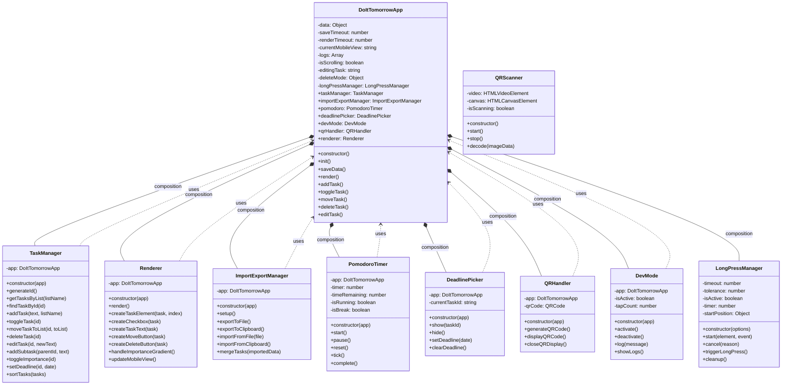
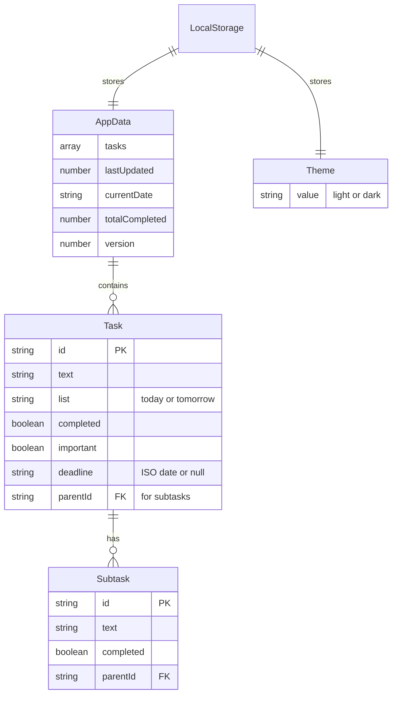
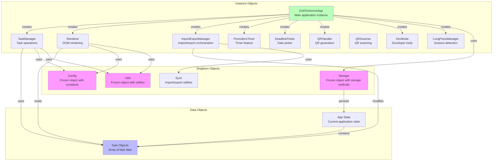
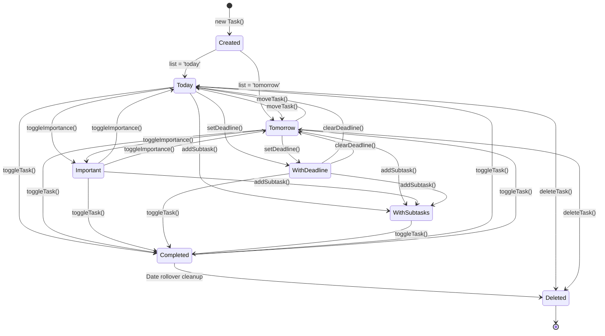
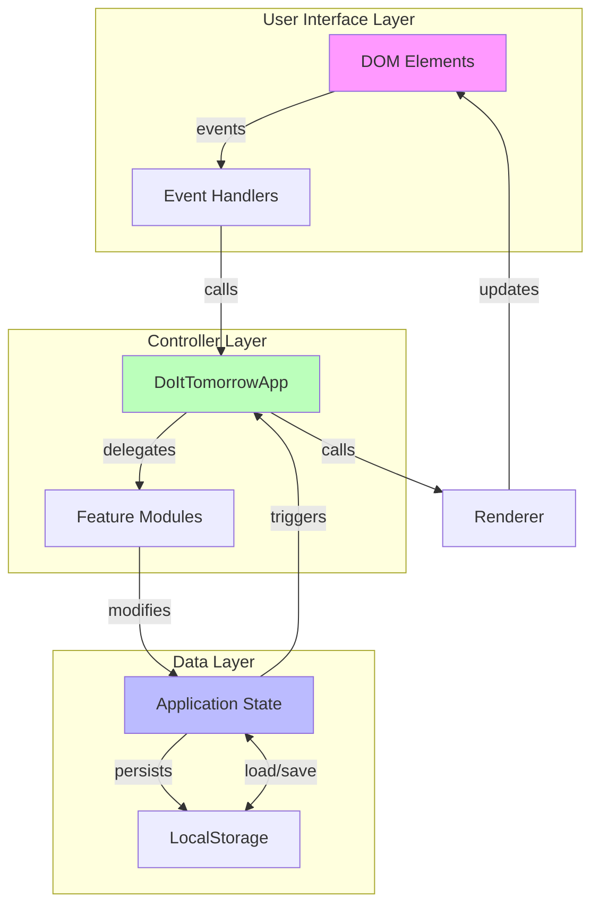
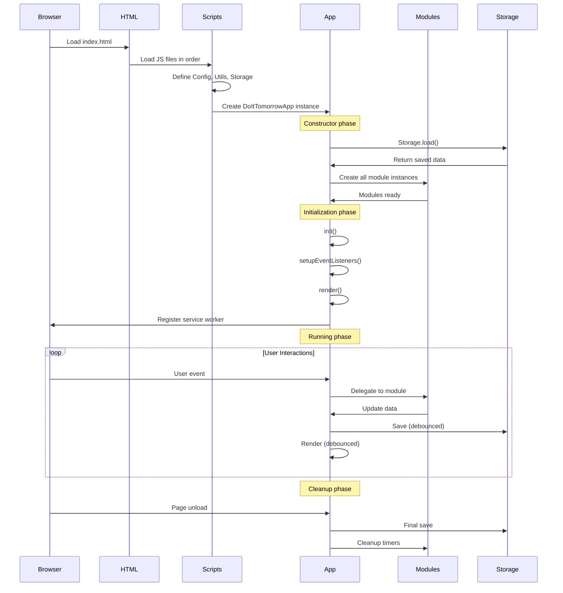
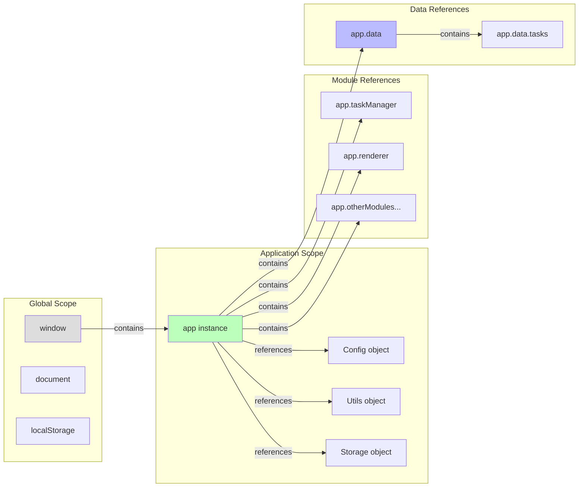

# Object Relationships

## Class Hierarchy

## Data Model Relationships

## Module Object Relationships

## Task Object State Transitions

## Component Communication Flow

## Object Lifecycle

## Memory References

